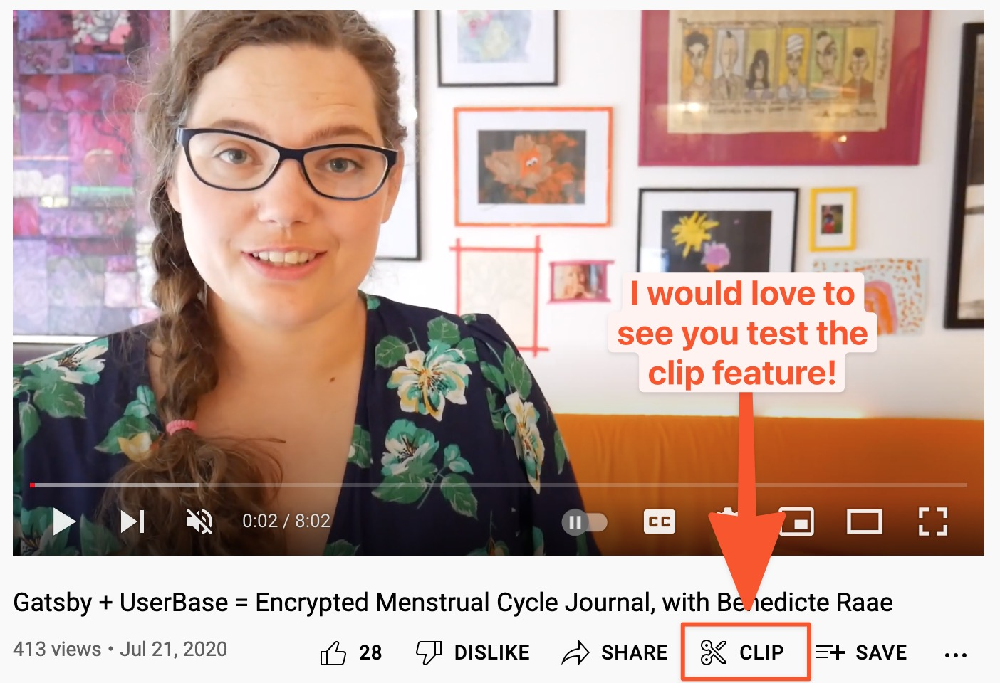

Are you wondering how you could create an encrypted web app like POW?

Well lucky you! In my Gatsby Days 2020 talk [Gatsby + UserBase = Encrypted Menstrual Cycle Journal](https://www.youtube.com/watch?v=kKp7Syxyxnw), I talk about just that.

The talk includes a little POW! back story and a walk-through of a simplified journaling app to focus on how you can do authenticated client-side only routes with Gatsby.

Check out [The Ugliest Journal](https://github.com/raae/gatsby-userbase-ugliest-journal) on Github to dive into the code.

&nbsp;  
All the best,  
Queen Raae

&nbsp;  
**PS:** Remember to give the video a thumbs up!
