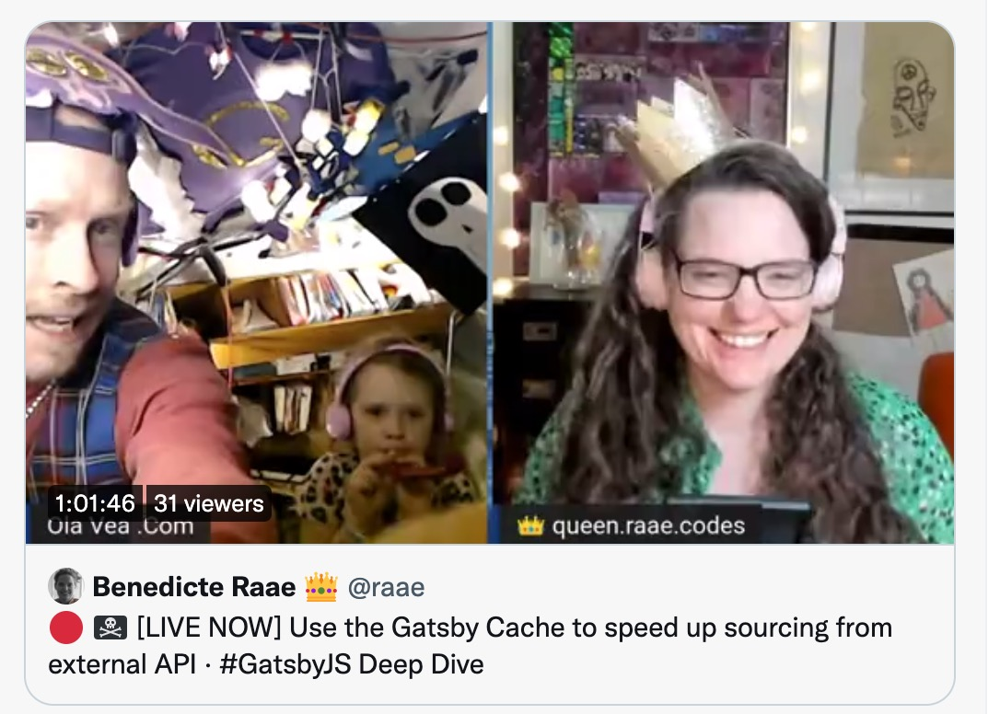

We are getting advanced today!

On yesterday's unauthorized and rum-fueled [treasure hunt](https://youtu.be/rURKTRPvSos) in the sharky waters around the Gatsby islands, we utilized the Gatsby Cache to skip fetching the YouTube oEmbed data again until the refresh interval is up!

[](https://youtu.be/rURKTRPvSos)

This is an improvement on the ever-evolving @raae/gatsby-source-youtube-oembed. Next week Ward Peters from Gatsby will be on the stream to show us how to support Gatsby Image CDN 🤩

## Why would we do this?

Gatsby has excellent caching built-in. If the YouTube oEmbed API response for a video has not changed, Gatsby will reuse the Gatsby YouTube Node that already exists, and the code in, for instance, `exports.onCreateNode` will not rerun. Pretty sweet, as there we source an external image into the Gatsby Content Layer, which is heavy-duty stuff.

However, Gatsy will call the YouTube oEmbed API for each video we are sourcing every time it runs through the `exports.sourceNodes` code.

Calls to external APIs can be time-consuming and sometimes even limited. I find this incredibly frustrating while developing, as I often rerun `gatsby develop` multiple times, and I know the data has not changed.

Gatsby Cache to the rescue!

## How did we do it?

After successfully fetching data from the YouTube oEmbed API and asking Gatsy to create a node with the data, we save the current timestamp and the id for the Gatsy YouTube Node created to cache:

```js
await cache.set(youTubeId, `${youTubeNodeId}>>>${Date.now()}`);
```

Then we can get that information from cache:

```js
const youTubeCache = await cache.get(youTubeId);
const [existingNodeId, timestamp] = youTubeCache?.split(">>>") || [];
```

To calculate if its time to fetch again from the YouTube oEmbed API or not.

If there is no need to fetch the data again, we have no data, and we cannot Gatsby to create a Gatsby YouTube Node for us. However, if we do nothing, Gatsby will throw away the existing Gatsby YouTube Node from its cache as it's not "touched."

We let Gatsby know we would like to keep the Gatsby YouTube Node around by touching it:

```js
const existingNode = getNode(existingNodeId);
touchNode(existingNode);
```

## Complete code

Below is the complete code; you can also see this in the [@raae/gatsby-source-youtube-oembed Pull Request](https://github.com/queen-raae/gatsby-source-youtube-oembed/pull/4) with minor improvements fitting for a plugin.

```js
const createYouTubeNode = async (gatsbyUtils, youTubeId) => {
  const {
    actions: { createNode, touchNode },
    createNodeId,
    createContentDigest,
    reporter,
    cache,
    getNode,
  } = gatsbyUtils;

  const youTubeCache = await cache.get(youTubeId);
  const [existingNodeId, timestamp] = youTubeCache?.split(">>>") || [];
  const existingNode = getNode(existingNodeId);
  const existingNodeAge = Date.now() - timestamp;
  const refreshInterval = 60000 * 5; // 5 min

  if (existingNode && existingNodeAge <= refreshInterval) {
    // Skip fetching embed data,
    // but touch node to keep it arround
    touchNode(existingNode);
    reporter.info(`Touch YouTube Node for ${youTubeId}`);
  } else {
    const youTubeNodeId = createNodeId(`you-tube-${youTubeId}`);
    const embedData = await fetchEmbed(youTubeId);

    createNode({
      id: youTubeNodeId,
      youTubeId: youTubeId,
      oEmbed: embedData,
      internal: {
        type: `YouTube`,
        contentDigest: createContentDigest(embedData),
      },
    });

    await cache.set(youTubeId, `${youTubeNodeId}>>>${Date.now()}`);
    reporter.info(`Create YouTube Node for ${youTubeId}`);
  }
};

exports.sourceNodes = async (gatsbyUtils, pluginOptions) => {
  const { youTubeIds } = pluginOptions;
  await Promise.all(youTubeIds.map((id) => createYouTubeNode(gatsbyUtils, id)));
};
```

## Questions?

Please let me know at queen@raae.codes or reply to this email! I want to improve my writing and better understand where folks get stuck when it comes to Gatsby.

&nbsp;  
All the best,  
Queen Raae
