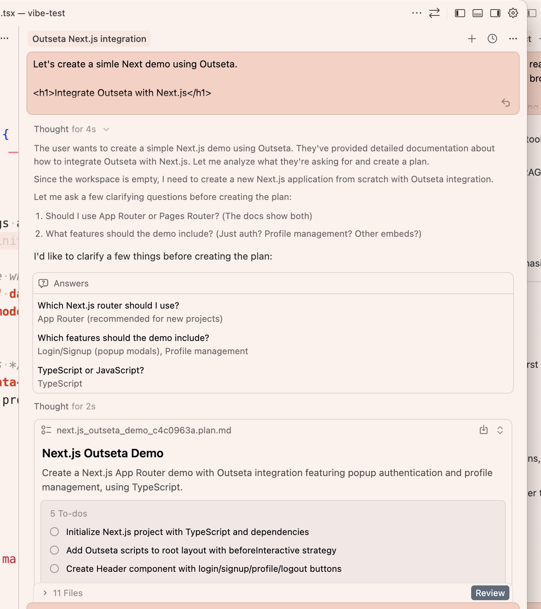

I copy-pasted my new [Outseta + Next.js article](https://go.outseta.com/support/kb/articles/B9lEKnW8/integrate-outseta-with-nextjs?via=queen) into Cursor and said "Let's create a simple Next demo using Outseta." Hit enter. And it one-shotted it. Completely correct.

I tried this a while back. Same kind of task — integrate Outseta. And I could not for the life of me get it to work. It kept inventing a react SDK that didn't exist, even when I gave it the exact script set up I wanted in the header.

But this time: **Boom.**

I looked through the code and the Outseta integration was there, the exact way I would have done it.

Hear me talk about it on [Slow & Steady ep. 235](https://slowandsteadypodcast.com/235?#t=16:19) ↓

<iframe width="100%" height="180" frameborder="no" scrolling="no" seamless="" src="https://share.transistor.fm/e/29d2248f?#t=16:19"></iframe>

We've gone from "I think we need to change how Outseta works in order to work with AI" to "AI can actually do it the way we expect it to."

That's a pretty big shift.

So what changed? I think it's the model. But it could be that I've gotten better at the context stuff as well...

When I was testing way back when, as in mid last year (2025), I tried all kinds of ways. Concrete step-by-step instructions, detailed specs, minimal specs, full access to [Outseta](https://outseta.com/?via=queen)'s knowledge base, you name it. Still garbage. Now I pasted in a single knowledge base article and the AI just got it. But here's the thing...The article was written with the help of Claude 😬 and I'm much more experienced prompt engineer these days. Perhaps that's what made the difference. Or a bit of both? Honestly, I'm not sure.

I might actually test this. Same article, same prompt, different models. See who one-shots it and who tries to download an SDK that doesn't exist.

Stay tuned 🤓
