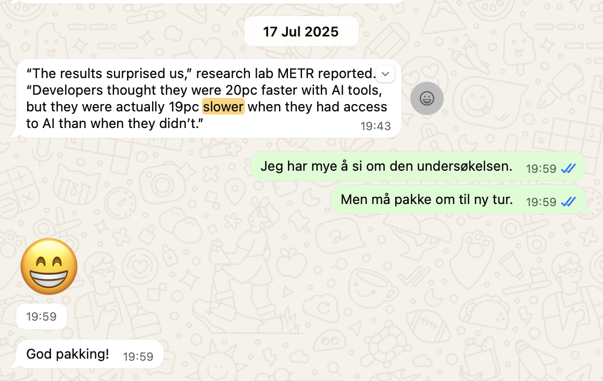

Last summer a [research paper](https://metr.org/blog/2025-07-10-early-2025-ai-experienced-os-dev-study/) was making a splash. 16 experienced open-source developers, 246 real coding tasks. AI made them **19% slower**. Not faster. Slower. And the developers themselves thought it had saved them 20%.

Fortune ran it as "[AI hampered productivity of software developers](https://fortune.com/article/does-ai-increase-workplace-productivity-experiment-software-developers-task-took-longer/)." It got so much publicity I had friends quoting it to me and my dad sent it on the family WhatsApp asking my take. Looking up the chat I see my answer was:

> I have a lot to say about that study. But gotta pack!
> <cite>Me to my dad on WhatsApp</cite>

I'm not questioning their findings. But I wonder if they measured the right thing.

The study gave developers assigned tasks and timed them. It measured how fast you do things you were already going to do. It didn't measure the things I would never have started without AI.

I never did reply to my dad. But Jean-Claude did help me start this blog post. So dad, here's your answer 😆

Like these emails I was trying to write in September to reconnect with old collaborators from a past project. Not complicated emails, but ones you, or at least I, dread to write:

> And it's just so hard, like it takes so much time. But not so much time in doing it, but just like procrastinating doing it... I've been like, you know, pushing it in front of me and then sitting down to write these emails is like, what do you write in these emails?
> <cite>🎧 Me on [Slow & Steady 228@01:08 (September 2025)](https://slowandsteadypodcast.com/228?#t=01:08) ↓</cite>

<iframe width="100%" height="180" frameborder="no" scrolling="no" seamless="" src="https://share.transistor.fm/e/c88aa2f3?#t=01:08"></iframe>

So I asked Jean-Claude to write them. He gave me a draft and it was... not great. But that was the whole point.

Benedikt nailed why this works — it's the coin-flip trick:

> It's like that test trick when you can't decide between two things. You just ask someone else to make the decision and then you don't blindly take that decision as yours. You judge your emotional reaction to it and then you know what you would want.
> <cite>🎧 Benedikt on [Slow & Steady 228@03:24 (September 2025)](https://slowandsteadypodcast.com/228?#t=03:24)</cite>

You don't need a good draft. You need _any_ draft to react to. The reaction tells you what you actually wanted to say.

That's one flavor of procrastination — not knowing what to say. There's another one: knowing exactly what needs doing, just not wanting to start. In our latest episode, Benedikt described that one too:

> Mind blown [...] There's a couple of things I wanted to do for a long time, but I knew would be cumbersome because a lot of small changes to a lot of small files... I realized that now with AI support, I could get over that initial hump of getting from nothing to somewhat working, relatively quickly. And then actually spend more time on the part that I enjoy doing.
> <cite>🎧 Benedikt on [Slow & Steady 235@21:29 (January 2026)](https://slowandsteadypodcast.com/235?#t=21:29) ↓</cite>

<iframe width="100%" height="180" frameborder="no" scrolling="no" seamless="" src="https://share.transistor.fm/e/29d2248f?#t=21:29"></iframe>

He shipped more annoying stuff in two weeks than he had all year. And then got to spend his time on the part he actually enjoys — the cleanup, the refactoring, the making-it-good part.

The gain isn't speed. It's starting. AI cuts the starting cost to near zero.

I'd love to see a study that measures the time we spend _not_ starting, not just how fast we finish. Is there a gain in the overall time? In efforts started?

But what if many of those things AI helps us start should have stayed undone? 🤔
