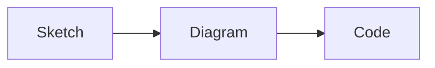
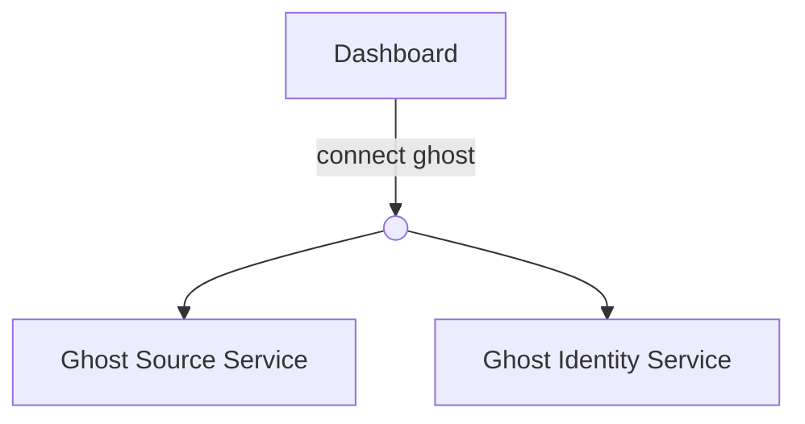

So I've started talking to Jean-Claude et al. in diagrams.

It started with a TLDraw sketch Ola made of the new Whee! theft flow.

I used a screenshot of the sketch as a starting point working with Cursor on implementing the flow. Edge cases revealed themselves. I am a big fan of TLDraw, but didn't really want to sketch it all out myself...

Then I remembered [Mermaid](https://mermaid.js.org) diagrams! Introduced to me by Kim when I did contract work at the bank. It lets you write diagrams that can be rendered by Mermaid.js. GitHub, Obsidian, Cursor and more all come with native support!

This code:

~~~

~~~

Renders as:

## Before coding: spec the shape first

Together we polished the diagram. Renamed states, added edge cases. Polished more. Shared the diagram with the team for input. Once we all agreed the diagram was right — Ola, me, the product owner and the LLM — Cursor knocked out the implementation pretty easily.

As always, the coding was not the hard part. Getting the concept correct. There was a lot to capture in that flow, and it's just easier to see in a diagram than a long description.

> "I created a mermaid diagram of the flow and like going through all the states. And then I took some notes that he (Ola) had made in TLDraw. I screenshotted that... and I put that into Cursor."
> <cite>🎧 Me on [Slow & Steady ep. 235 (at 17:50)](https://slowandsteadypodcast.com/235?#t=17:50) ↓</cite>

<iframe width="100%" height="180" frameborder="no" scrolling="no" seamless="" src="https://share.transistor.fm/e/29d2248f?#t=17:50"></iframe>

## After coding: review what the AI built

And it works both ways. Last week I asked Jean-Claude to diagram what he'd built in [Galleon](https://galleon.tools). Not the plan, but what had been built so far.

He spat out an architectural overview Mermaid diagram. I looked at it for maybe ten seconds and spotted awkwardness. One concept that at the moment uses the same service, but conceptually is two different things and should be modelled as such.

📹 [See the workflow in action](https://www.youtube.com/shorts/e2IAxtvFFFk)

## The real win: same diagram, multiple audiences

Diagrams FTW!

In Whee, the theft flow diagram helped us get sign-off from the product owner. It helped Ola, who's more junior, understand the flow and all its edge cases. And honestly, it helped me wrap my head around all the edge cases before implementing.

For Galleon where I'm testing out an AI-heavy workflow, it's helped build a shared understanding between Jean-Claude, Ola and I. As an added bonus: better docs along the way than I've ever had before.
