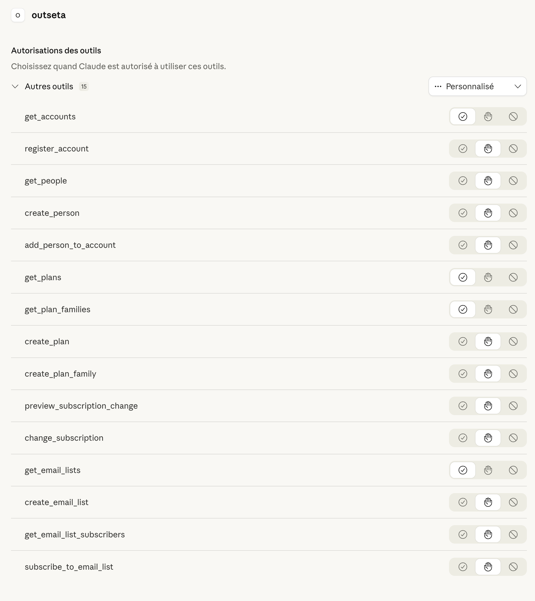
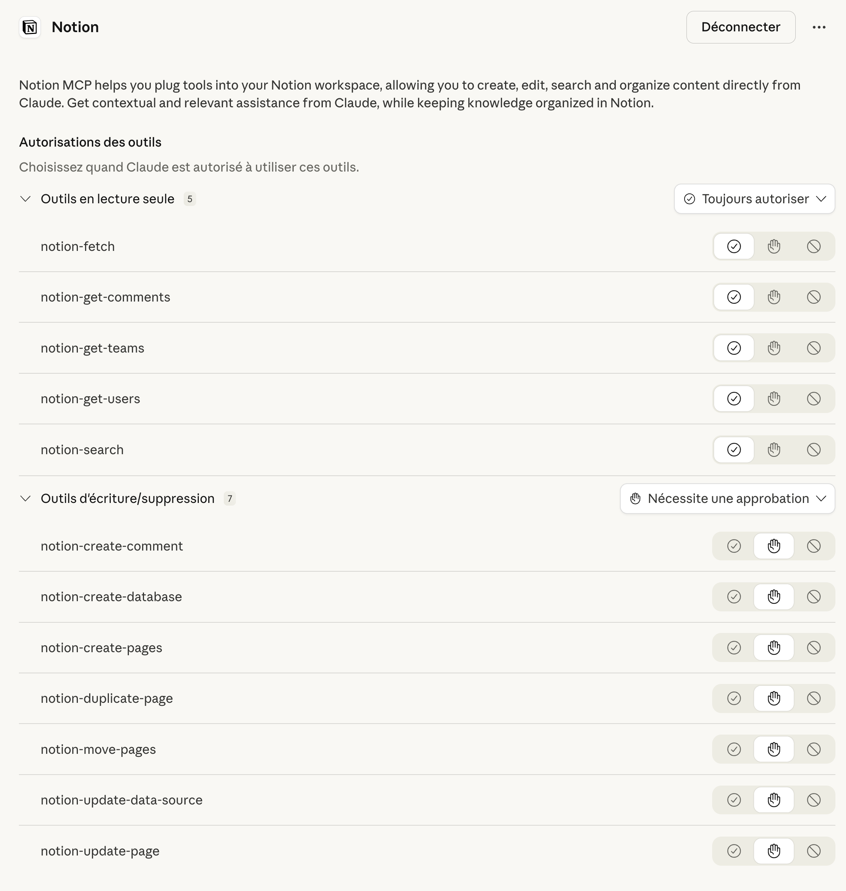
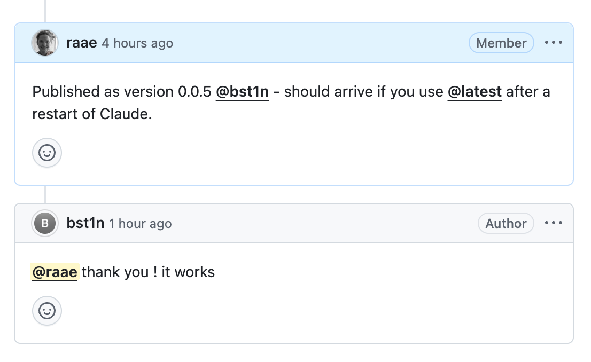

Back in August I built the [Outseta MCP server MVP](https://github.com/outseta/outseta-admin-mcp-server) to showcase how one could enable Jean-Claude (my Claude Code instance) and other AI tools to manage stuff in your [Outseta](https://outseta.com?via=queen) account. Stuff like users, billing, email lists etc.

No delete tools were included, but it had both write and update tools. After months of very little feedback [Bastien opened an issue](https://github.com/outseta/outseta-admin-mcp-server/issues/2) that made me go "oh, I didn't even know that was possible."

## The problem I hadn't noticed

When you add an MCP server to Claude Desktop, it asks what permission level you want for the tools. Always allow, require approval, or never. Pretty standard.

The catch? Claude Desktop was showing all 15 Outseta tools as one undifferentiated blob. "Other tools." So your choices were: decide permission settings for all. Or do them one by one.



Bastien pointed to the [Notion MCP server](https://github.com/makenotion/notion-mcp-server) as the reference. There, read-only tools and write tools show up as separate groups. You can batch set the permission for each group 🤯



I had not noticed that MCP servers could do that.

## The fix: tool annotations

Turns out the MCP spec has an annotations system. You set hints on each tool — `readOnlyHint`, `destructiveHint`, `openWorldHint` — and the client uses those to group and scope permissions.

I defined three tiers:

```typescript
const READ_ANNOTATION = {
  readOnlyHint: true,
  destructiveHint: false,
  openWorldHint: true,
} as const;

const WRITE_ANNOTATION = {
  readOnlyHint: false,
  destructiveHint: false,
  openWorldHint: true,
} as const;

const DESTRUCTIVE_ANNOTATION = {
  ...WRITE_ANNOTATION,
  destructiveHint: true,
} as const;
```

Then categorized all 15 tools:

- **7 read-only** — `get_accounts`, `get_people`, `get_plans`, `get_plan_families`, `get_email_lists`, `get_email_list_subscribers`, `preview_subscription_change`
- **7 write** — `register_account`, `create_person`, `add_person_to_account`, `create_plan`, `create_plan_family`, `create_email_list`, `subscribe_to_email_list`
- **1 destructive** — `change_subscription`

## Why `change_subscription` gets the destructive flag

This was the one I had to think about. Most write tools here are creating things — a new person, a new plan. Easy to undo. But changing a subscription hits billing. Prorations, invoice changes, real money moving. That's not a casual "oops, delete it" situation.

Claude Desktop doesn't actually render a separate group for destructive vs. regular writes — yet. But `destructiveHint` is in the spec for a reason. When clients start using it, the annotation is already there. And honestly, it's just good documentation. Anyone reading the tool list can see: this one has consequences.

## The API change

The SDK has two ways to register tools. The positional-args version (`server.tool()`) doesn't support annotations cleanly. The config-object version (`server.registerTool()`) does:

```typescript
server.registerTool(
  "get_accounts",
  {
    description: "Query accounts with filtering and pagination",
    inputSchema: GetAccountsSchema.shape,
    annotations: READ_ANNOTATION,
  },
  async (params) => {
    // ...
  },
);
```

Both are built into `@modelcontextprotocol/sdk`. No custom code needed. I just hadn't used `registerTool` before.

## If you're building an MCP server

Three things I'd steal from this:

1. **Look at the Notion MCP server.** I keep hearing good things about it, and it clearly uses the spec features well. A solid reference if you're figuring out annotations.
2. **Annotate your tools from day one.** The three-constant pattern (`READ`, `WRITE`, `DESTRUCTIVE`) covers most cases. Your users get granular permissions for free.
3. **Think about what "destructive" means in your domain.** For Outseta, it's billing mutations — and deletions too, when we add those. For your tool it might be deleting records, sending emails, or modifying permissions. If the user would want a confirmation dialog, it's probably destructive.

---

Customer like Bastien are worth their weight in gold 🙏



Building an MCP server? I'm curious what what other patterns you've discovered that I should know about. [Hit me up](mailto:queen@raae.codes)!
