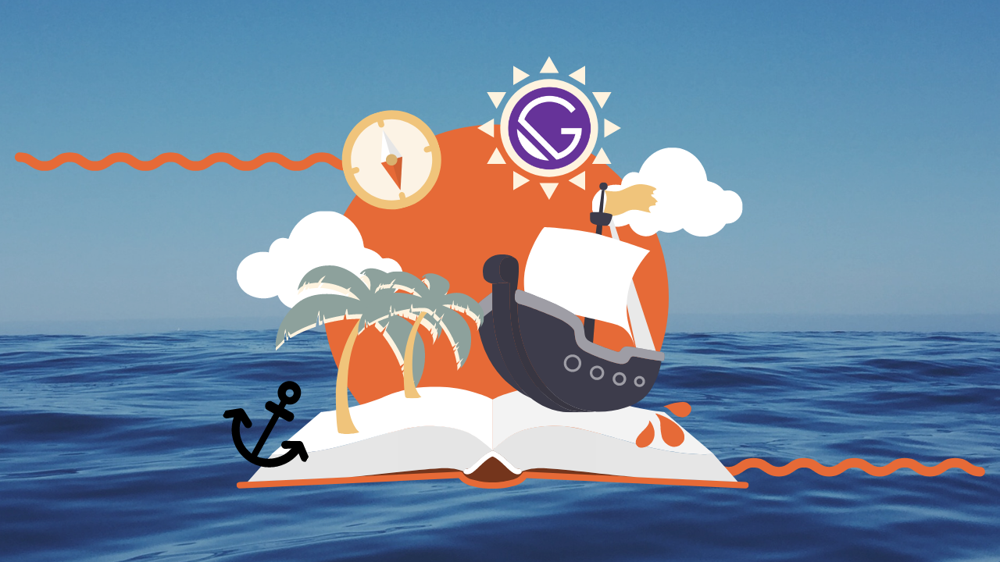

## Useful links/tips

- [YouTube Studio Live Videos](https://studio.youtube.com/channel/UCDlrzlRdM1vGr8nO708KFmQ/videos/live)
- Sign in to [streamyard.com](https://streamyard.com/) using `streamyard@lillylabs.no`. It will forward the login code to all emails in the "group". Not getting them, let Benedicte know and she'll add your email.

## Tweet

```
🔔 🏴‍☠️ Stream incoming
<Thursday/Today> at 19:00 CET 🏴‍☠️ 🔔

<Text about stream>

@OlaHolstVea will be there, will you?

Voyage deets 👇🏻
```

```
It will be fun; it will be informal!
You might even learn a thing or two...

🥛 🍷 🥤 🍺

🗓 Tune in Thursdays
🕰 at 19:00 (Oslo / Berlin / CEST)
📺 on Queen Raae's YouTube

<YouTube Link>
```

## Go live SOP

1. Go to [streamyard.com](https://streamyard.com/)
2. Make sure Tweet is enabled and correct

## Schedule SOP

1. Go to [streamyard.com](https://streamyard.com/)
2. Select "Create a broadcast" -> "New broadcast"
3. Select only "YouTube" under "Broadcast to"
4. Add title and description per templates below
5. Create Tweet (if not TBD title) by adding
   - `[LIVE NOW]` after emojis
   - `➽ Better quality and conversation on YouTube <YT link/>` to the end

### YouTube Template

#### Title

```md
🔴 🏴‍☠️ <title> · #GatsbyJS Deep Dive

🔴 🏴‍☠️ Unauthorized and rum-fueled treasure hunt · #GatsbyJS Deep Dive
```

#### Description

```md
# The Crew

Pirate Ola · @OlaHolstVea · https://twitter.com/OlaHolstVea  
Queen Raae · @raae · https://twitter.com/raae

# Who is Queen Raae

Queen Raae is a seasoned web developer who loves duct-taping together side projects in addition to making apps trusted by the Swedish Armed Forces, The Norwegian Water Resources and Energy Directorate, and others.

# More from Queen Raae

- [Daily emails from the Queen and cap'n Ola on how to get the most out out Gatsby](https://queen.raae.codes/emails/?utm_source=youtube&utm_campaign=description&utm_content=pirate-show)
```

### Event Template (when guests)

```md
On this steam we will <topic of the stream>.

<More info>

While waiting for thing to build, bugs to be fixed etc. Ola will ask you questions about your life/work. If you have any pets we would love to see them.

--- Practical ---

We stream on StreamYard, no login needed - just head on over to <stream link> 5-10 minutes before the hour.

It's usually pretty chaotic on our end for those minutes, as we prep the family to go live 🤪

If you want more information, they have a guest help article you may read: https://support.streamyard.com/hc/articles/360043291612.

We also recommend you open the stream on YouTube <youtube link> in a seperate and MUTED tab so you can participate in the chat if/when needed.

There is a private chat in Streamyard if you want to tell us something while streaming, or need to send us links to open.
```

### Thumbnail


